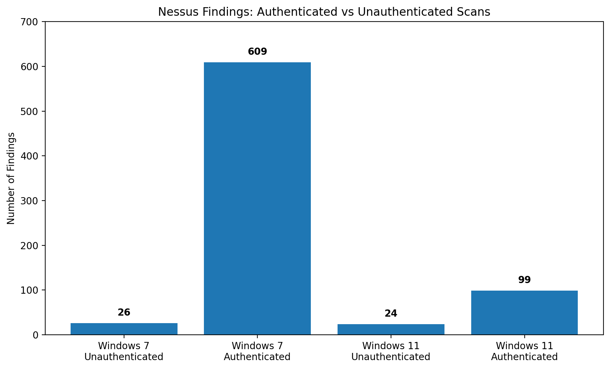

# Analysis

This directory contains comparison data and, later, detailed analysis of findings by severity, plugin, and scan type.

## Current comparison

- Windows 7 unauthenticated: 26 findings
- Windows 7 authenticated: 609 findings
- Windows 11 unauthenticated: 24 findings
- Windows 11 authenticated: 99 findings

## Findings Comparison

